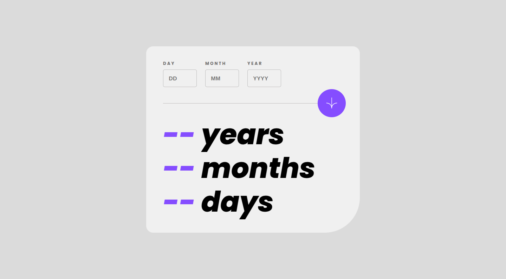
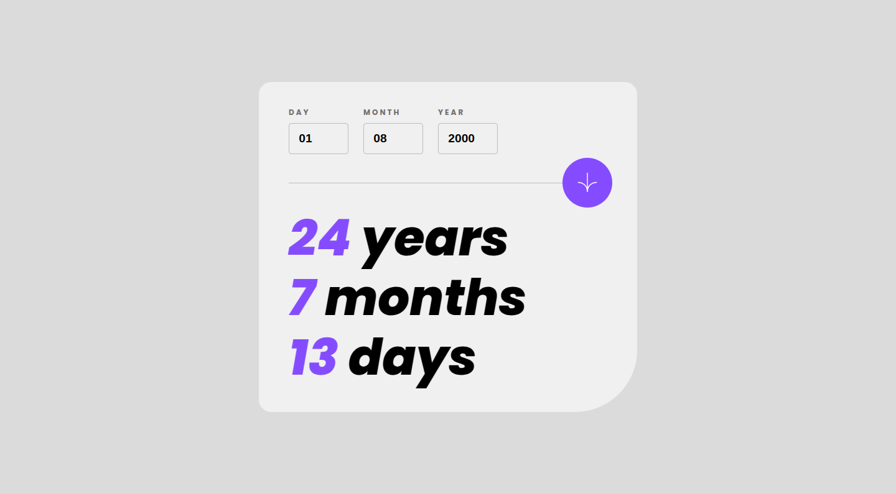
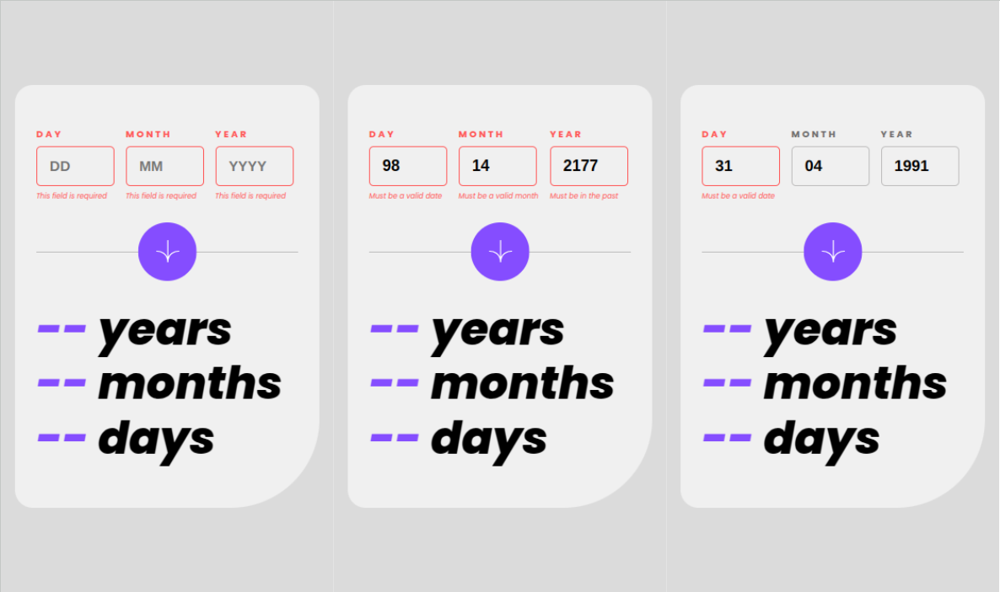
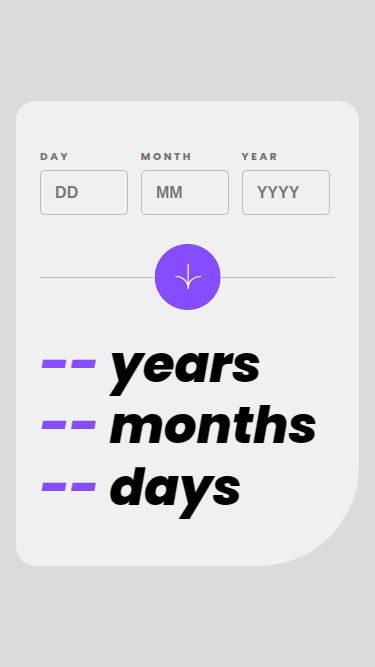
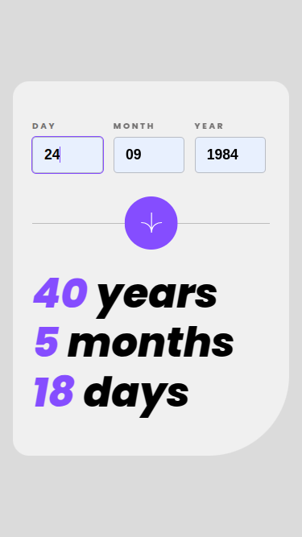

# 🖼 Frontend Mentor - Age calculator app solution

This is a solution to the [Age calculator app challenge on Frontend Mentor](https://www.frontendmentor.io/challenges/age-calculator-app-dF9DFFpj-Q). Frontend Mentor challenges help you improve your coding skills by building realistic projects. project.

##  📋 Table of contents

-  Overview

-  Screenshot

-  Links

-  My process

-  Built with

-  Useful resources

- What I learned

-  Author

-  Thanks

##  📖 Overview

This challenge is designed to enhance participants' JavaScript and form validation skills, with a focus on working with dates, which can often be tricky in JavaScript. The goal is to build an age calculator app that calculates and displays a person's age in years, months, and days after they submit a valid date through the form.

**Participants will need to implement various form validation features, including:**

- Ensuring no fields are empty upon form submission.
- Verifying that the day number is between 1 and 31, and the month number is between 1 and 12.
- Checking that the date is not in the future.
- Validating the date to ensure it's correct (e.g., rejecting invalid dates like 31/04/1991).

**The app must also:**

- Display the optimal layout based on the device's screen size.
- Include hover and focus states for all interactive elements on the page.
- **Bonus:** Animate the age numbers as they transition to their final values after form submission.

###  📸 Screenshot

These are the screenshots of the implemented solution:

-  **🖥️ Desktop version**

-  **❌ Errors**  

-  **📱 Mobile version**

-  **⚡ Active**  

###  ⛓️ Links

-  src folder: [src](https://github.com/NorimNori/age-calculator-gap/tree/main/src)

-  components folder: [components](https://github.com/NorimNori/age-calculator-gap/tree/main/src/components)

-  Live Site URL: [on Netlify](https://age-calculator-gap-by-gr.netlify.app/)

##  📌 My process

###  🪚 Built with

-  React.js

-  JavaScript

-  Vite

-  SCSS styles

-  CSS Grid

-  Mobile-first workflow

-  BEM class naming 

-  ARIA (Accesible Rich Internet Applications).

-  Google fonts

###  🔬 What I learned

This challenge required me to pay much closer attention to the logic behind error handling, as it proved to be more complex than in previous challenges. Handling the different edge cases, such as invalid dates or empty fields, involved deeper thought and attention to detail. Additionally, I spent significant time working with the `Date()` object and its methods like `getFullYear()`, `getMonth()`, and `getDate()`. Initially, understanding how to correctly extract and manipulate date values using these methods was a bit confusing, especially considering how the `getMonth()` method returns a zero-based index.

While I was able to get the functionality working, I feel that the code could still be optimized, particularly in terms of readability and performance. I plan to revisit the logic in the future and make improvements where needed, ensuring that the code is as efficient and clean as possible. However, this challenge was incredibly valuable for improving my understanding of JavaScript’s date handling and my ability to implement form validation. It also provided a great opportunity to develop my algorithm-building skills, which will be essential as I continue to take on more complex **JavaScript** projects.

###  📝 Useful resources
-  [Date](https://developer.mozilla.org/es/docs/Web/JavaScript/Reference/Global_Objects/Date) -  This link leads to the official **Mozilla Developer Network (MDN)** documentation for the` Date` object in **JavaScript**. It provides a detailed overview of how to work with dates, including how to create, manipulate, and format dates using JavaScript. The documentation is comprehensive and suitable for both beginners and experienced developers seeking to understand date-related functions in JavaScript

-  [getFullYear()](https://developer.mozilla.org/es/docs/Web/JavaScript/Reference/Global_Objects/Date/getFullYear) -   This link takes you to the MDN documentation for the `getFullYear()` method, which returns the year of a given date object as a four-digit number. The page explains how this method works, including its syntax and usage examples. It’s an essential resource for working with years in **JavaScript**.

-  [getMonth()](https://developer.mozilla.org/es/docs/Web/JavaScript/Reference/Global_Objects/Date/getMonth) -  This link directs to the MDN documentation for the `getMonth()` method. It explains how this method returns the month (0-11) for a given date, and provides important details on how JavaScript uses a zero-based index for months (January is 0, February is 1, etc.). This resource is helpful for handling months in **JavaScript**.

-  [getDay()](https://developer.mozilla.org/es/docs/Web/JavaScript/Reference/Global_Objects/Date/getDay) -  This link leads to the MDN documentation for the `getDay()` method, which returns the day of the week (0-6) for a given date object. The documentation offers clear examples and explanations, making it a useful reference for working with days of the week in **JavaScript**.

-  [Number](https://developer.mozilla.org/en-US/docs/Web/JavaScript/Reference/Global_Objects/Number) -  This link points to the MDN documentation for the `Number` object in **JavaScript**. It covers how to work with numeric values in JavaScript, including methods for converting values to numbers, handling numbers as objects, and other useful techniques. It is a key resource for anyone working with numeric data types in JavaScript.

##  👋 Author

-  LinkedIn - [Gloria Rangel](https://www.linkedin.com/in/gloria-rangel-06b960306/)

-  Frontend Mentor - [@NorimNori](https://www.frontendmentor.io/profile/NorimNori)

##  🌟 Thank You 🌟

Thanks for visiting this repository! I hope you found it useful and inspiring, or it was just a fun time.

A special thanks to [Frontend Mentor](https://www.frontendmentor.io) for the challenge and for being such an amazing platform to learn and grow as a developer.

Have a nice day! 😊
